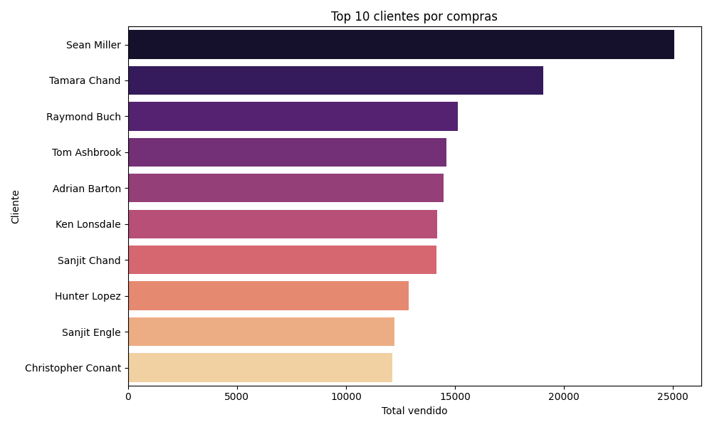
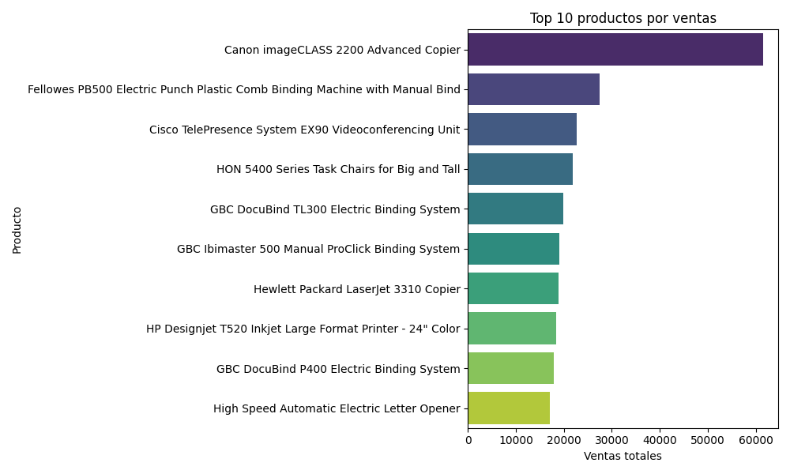
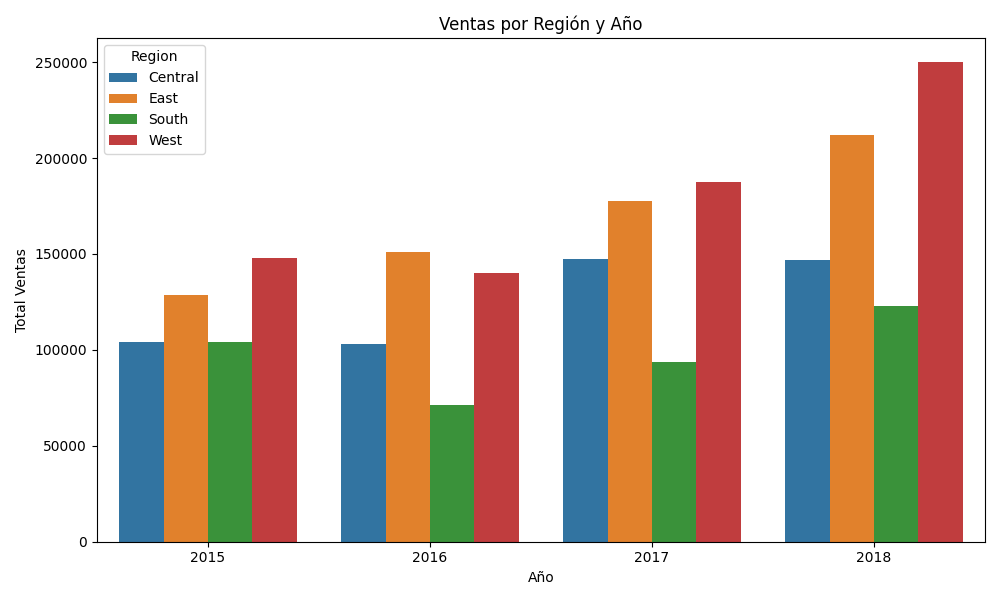
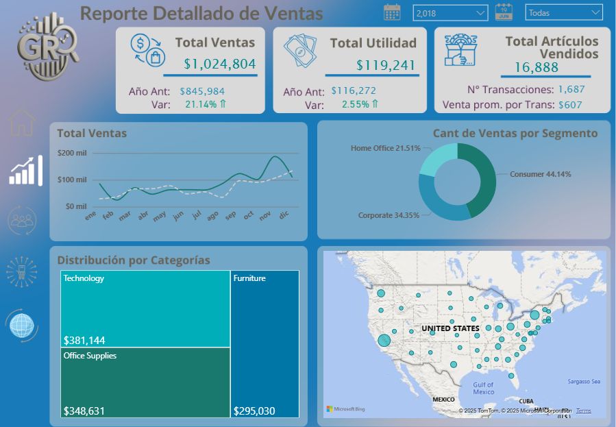
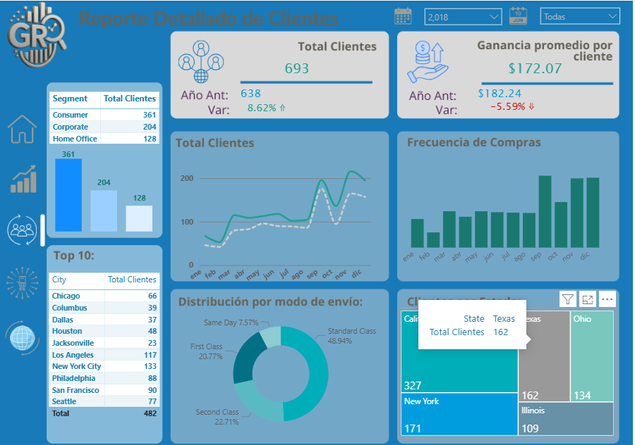
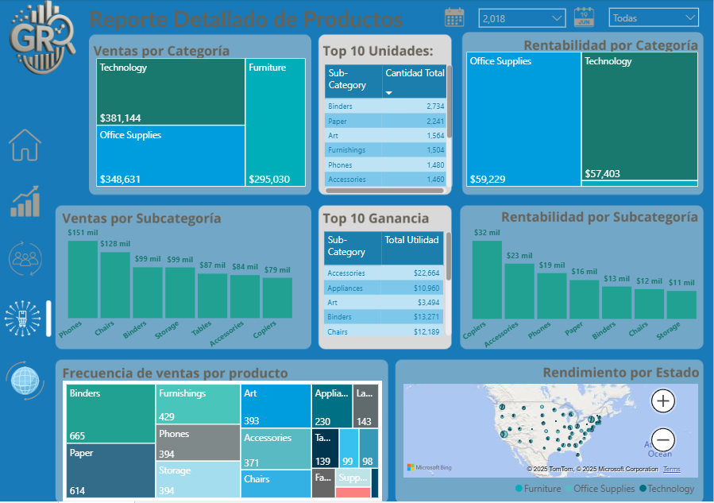

# 🧠 Superstore - Análisis de Ventas

Este proyecto desarrolla un modelo dimensional sobre el dataset de ventas "Superstore", utilizando `SQLite` como base de datos y `Power BI` para la visualización interactiva de reportes de negocio.

## 📂 Estructura del Proyecto

```bash
superstore_ventas/
│
├── data/
│   ├── superstore.csv
│   ├── superstore.db
│   ├── superstore_modelado.db
│
├── scripts/
│   ├── load_data_modelado.py
│   ├── init_modelo.py
│
├── visualizaciones/
│   └── Superstore_Reportes.pbix
│
├── schema.sql
├── requirements.txt
├── README.md
```

## 🔍 Descripción General

Este proyecto tiene como objetivo modelar, analizar y visualizar las ventas realizadas por la tienda Superstore. A partir del archivo original `superstore.csv`, se construye una base de datos con un modelo estrella, y se genera un dashboard profesional en `Power BI`.

## 📊 Modelo Dimensional

### Tabla de hechos: `FactVentas`

### Dimensiones:

* `DimProducto`

* `DimSubcategoria`

* `DimCategoria`

* `DimCiudad`

* `DimEstado`

* `DimPais`

* `DimSegmento`

* `DimShipMode`

* `Calendario`

El modelo fue construido mediante scripts en `Python` usando `pandas` y `sqlalchemy`, y cargado en `superstore_modelado.db`.

## 🔄 Flujo del Proyecto

* `init_modelo.py`

* Crea la tabla `Calendario` con atributos de fecha enriquecidos.

* `load_data_modelado.py`

* Lee `superstore.db`

* Construye las tablas dimensionales

* Genera la tabla `FactVentas`

* Exporta el modelo a `SQLite`

* `Superstore_Reportes.pbix`

* Visualizaciones profesionales con segmentadores de tiempo

* Navegación por botones y KPIs

## 🌐 Visualización en Power BI

* Portada con identidad visual

* Dashboard de Ventas por producto, ciudad y tiempo

* Dashboard de Clientes por segmento, ticket promedio, frecuencia

* Dashboard de Categorías por subcategoría, rentabilidad, descuentos

* Incluye medidas calculadas en una tabla separada, segmentadores de fecha y filtros.

## 🖼️ Visualizaciones en Python

### 👥 Top 10 Clientes


### 🖥️ Top 10 Productos


### 🗺️ Ventas Anuales por Region


## 📚 Requisitos

`Python 3.10`+

`Power BI Desktop`

`SQLite3` o `DB Browser for SQLite` (opcional)

### Bibliotecas Python:

`pandas`

`sqlalchemy`

### Instalación:

```bash
pip install -r requirements.txt
```

## 🚀 Ejecución Paso a Paso

### Paso 1: Ejecutar script de creación del calendario
`python scripts/init_modelo.py`

### Paso 2: Crear el modelo dimensional completo
`python scripts/load_data_modelado.py`

### Paso 3: Abrir archivo PBIX para visualizar
`start visualizaciones/Superstore_Reportes.pbix`

## 📷 Capturas de pantalla

### 📌 Portada


### 📊 Dashboard de Ventas


### 👥 Dashboard de Clientes


### 🧱 Dashboard de Productos


## 👤 Autor

### Ramon G.
Analista de Datos | Modelado Dimensional | Visual Analytics

## 🌍 Licencia

Uso educativo y profesional. Puedes adaptar y reutilizar este proyecto con fines de aprendizaje y mejora continua.


## 📬 Contacto
### ¿Tienes feedback o preguntas?
### Escríbeme por GitHub o conecta en LinkedIn.